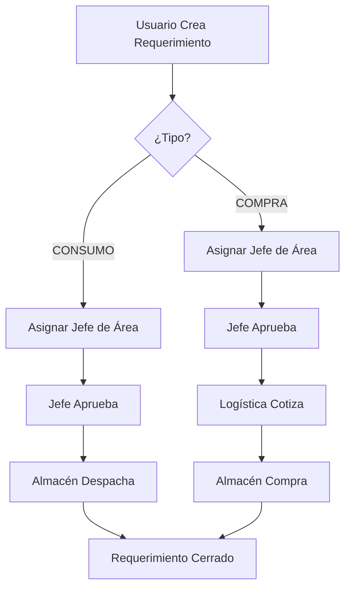

# 🔄 FLUJO DE APROBACIONES POR ÁREA

## 📊 **ESTRUCTURA ACTUAL DE ROLES**

El sistema actual tiene estos roles definidos:

| Rol | Código | Área | Función |
|-----|--------|------|---------|
| **TI** | TILOGIST | Sistemas | Administración del sistema |
| **Aprobador** | APLOGIST | Aprobaciones | Aprobación de requerimientos |
| **Almacén** | ALLOGIST | Almacén | Gestión de inventario |
| **Logístico** | LOLOGIST | Logística | Gestión de compras |
| **Operativo** | OPLOGIST | Operaciones | Creación de requerimientos |
| **Empaque** | EMLOGIST | Empaque | Gestión de empaque |

---

## 🎯 **PROPUESTA DE SOLUCIÓN**

### **Opción 1: Jerarquía por Áreas (Recomendada)**

#### **1. Estructura de Áreas**

```typescript
interface Area {
  codigo: string;
  nombre: string;
  responsableAprobacion: string; // Rol que aprueba
}

const AREAS = [
  {
    codigo: 'ADMINISTRACION',
    nombre: 'Administración',
    responsableAprobacion: 'APLOGIST'
  },
  {
    codigo: 'OPERACIONES',
    nombre: 'Operaciones',
    responsableAprobacion: 'OPLOGIST' // Jefe de Operaciones aprueba
  },
  {
    codigo: 'ALMACEN',
    nombre: 'Almacén',
    responsableAprobacion: 'ALLOGIST' // Jefe de Almacén aprueba
  },
  {
    codigo: 'LOGISTICA',
    nombre: 'Logística',
    responsableAprobacion: 'LOLOGIST' // Jefe de Logística aprueba
  },
  {
    codigo: 'EMPAQUE',
    nombre: 'Empaque',
    responsableAprobacion: 'EMLOGIST' // Jefe de Empaque aprueba
  },
  {
    codigo: 'MANTENIMIENTO',
    nombre: 'Mantenimiento',
    responsableAprobacion: 'OPLOGIST' // Operaciones aprueba
  },
  {
    codigo: 'PRODUCCION',
    nombre: 'Producción',
    responsableAprobacion: 'LOLOGIST' // Logística aprueba
  }
];
```

#### **2. Flujo de Aprobación**

```typescript
// Para requerimientos de COMPRA
FLUJO_COMPRA = [
  'OPERATIVO' // Crea el requerimiento
] → 
[
  'JEFE_AREA' // Aprueba según área del solicitante
] → 
[
  'LOGISTICA' // Aprueba y cotiza
] → 
[
  'ALMACEN' // Aprueba y compra
]

// Para requerimientos de CONSUMO
FLUJO_CONSUMO = [
  'OPERATIVO' // Crea el requerimiento
] → 
[
  'JEFE_AREA' // Aprueba según área del solicitante
] → 
[
  'ALMACEN' // Aprueba y despacha
]
```

---

## 🛠️ **IMPLEMENTACIÓN**

### **1. Base de Datos - Nueva Tabla**

```sql
CREATE TABLE LOGISTICA_UsuariosPorArea (
    idUsuarioArea INT IDENTITY(1,1) PRIMARY KEY,
    documentoidentidad VARCHAR(20) NOT NULL,
    nombreCompleto VARCHAR(200) NOT NULL,
    area VARCHAR(50) NOT NULL,
    rol VARCHAR(20) NOT NULL,
    esJefeArea BIT DEFAULT 0,
    email VARCHAR(100),
    activo BIT DEFAULT 1
)

-- Índices
CREATE INDEX IX_UsuariosPorArea_Area ON LOGISTICA_UsuariosPorArea(area);
CREATE INDEX IX_UsuariosPorArea_Rol ON LOGISTICA_UsuariosPorArea(rol);
CREATE INDEX IX_UsuariosPorArea_Jefe ON LOGISTICA_UsuariosPorArea(esJefeArea);
```

### **2. Stored Procedure para Determinar Aprobador**

```sql
CREATE PROCEDURE LOGISTICA_obtenerAprobadorPorArea
    @areaSolicitante VARCHAR(50),
    @tipoRequerimiento VARCHAR(20) -- 'COMPRA' o 'CONSUMO'
AS
BEGIN
    DECLARE @aprobador VARCHAR(20)
    
    IF @tipoRequerimiento = 'COMPRA'
    BEGIN
        -- Para compras: Jefe de área del solicitante
        SELECT TOP 1 
            u.documentoidentidad,
            u.nombreCompleto,
            u.email,
            'JEFE_AREA' AS tipoAprobador
        FROM LOGISTICA_UsuariosPorArea u
        WHERE u.area = @areaSolicitante
          AND u.esJefeArea = 1
          AND u.activo = 1
    END
    ELSE IF @tipoRequerimiento = 'CONSUMO'
    BEGIN
        -- Para consumo: Jefe de área o Almacén
        SELECT TOP 1 
            u.documentoidentidad,
            u.nombreCompleto,
            u.email,
            CASE WHEN u.esJefeArea = 1 THEN 'JEFE_AREA' ELSE 'ALMACEN' END AS tipoAprobador
        FROM LOGISTICA_UsuariosPorArea u
        WHERE (u.area = @areaSolicitante AND u.esJefeArea = 1)
           OR (u.rol = 'ALLOGIST' AND u.activo = 1)
        ORDER BY 
            CASE WHEN u.esJefeArea = 1 THEN 1 ELSE 2 END
    END
END
```

### **3. Servicio en Frontend**

```typescript
// usuarios-area.service.ts
@Injectable({
  providedIn: 'root'
})
export class UsuariosAreaService {
  
  async obtenerAprobadorPorArea(area: string, tipo: 'COMPRA' | 'CONSUMO'): Promise<any> {
    // Llamar al backend para obtener el aprobador
  }
  
  async obtenerUsuariosPorArea(area: string): Promise<any[]> {
    // Obtener todos los usuarios de un área
  }
  
  async obtenerJefesDeArea(): Promise<any[]> {
    // Obtener todos los jefes de área
  }
}
```

### **4. Modificación en Requerimientos**

```typescript
// requerimientos.component.ts
async guardarRequerimiento() {
  // ... código existente ...
  
  // NUEVO: Determinar aprobador según área
  const aprobador = await this.usuariosAreaService.obtenerAprobadorPorArea(
    this.usuario.area, // área del usuario logueado
    this.requerimiento.tipo // 'COMPRA' o 'CONSUMO'
  );
  
  // Asignar aprobador
  this.requerimiento.usuarioAprueba = aprobador.documentoidentidad;
  this.requerimiento.estadoAprobacion = 'PENDIENTE';
  
  // ... continuar con el guardado ...
}
```

---

## 📋 **DATOS DE EJEMPLO**

### **Usuarios por Área**

| Documento | Nombre | Área | Rol | Es Jefe |
|-----------|--------|------|-----|---------|
| 12345678 | Juan Pérez | OPERACIONES | OPLOGIST | 1 |
| 87654321 | María López | OPERACIONES | OPLOGIST | 0 |
| 45678912 | Carlos Ruiz | ALMACEN | ALLOGIST | 1 |
| 78912345 | Ana Martínez | ALMACEN | ALLOGIST | 0 |
| 32165498 | Luis Gómez | LOGISTICA | LOLOGIST | 1 |
| 98765432 | Sandra Díaz | LOGISTICA | LOLOGIST | 0 |

### **Flujo Ejemplo**

1. **María López** (OPERACIONES) crea requerimiento de **COMPRA**
2. Sistema detecta: área = OPERACIONES, tipo = COMPRA
3. Sistema asigna aprobador: **Juan Pérez** (Jefe de Operaciones)
4. Juan aprueba → pasa a **Luis Gómez** (Logística) para cotización
5. Luis aprueba → pasa a **Carlos Ruiz** (Almacén) para compra

---

## 🎯 **VENTAJAS DE ESTA SOLUCIÓN**

1. **Escalable**: Fácil agregar nuevas áreas
2. **Flexible**: Cada área puede tener su propio aprobador
3. **Auditable**: Se registra quién aprueba y por qué
4. **Automático**: El sistema determina el aprobador automáticamente
5. **Configurable**: Se puede cambiar el flujo sin modificar código

---

## 📊 **DIAGRAMA DE FLUJO**



---

## 🚀 **PASOS PARA IMPLEMENTAR**

### **Fase 1: Base de Datos**
1. Crear tabla `LOGISTICA_UsuariosPorArea`
2. Crear SP `LOGISTICA_obtenerAprobadorPorArea`
3. Migrar usuarios existentes
4. Insertar datos de prueba

### **Fase 2: Backend**
1. Crear endpoint `/api/usuarios/aprobador-por-area`
2. Modificar lógica de requerimientos
3. Actualizar guards si es necesario

### **Fase 3: Frontend**
1. Crear servicio `UsuariosAreaService`
2. Modificar componentes de requerimientos
3. Agregar selector de área en perfil de usuario
4. Actualizar flujo de aprobaciones

### **Fase 4: Pruebas**
1. Probar flujo con diferentes áreas
2. Verificar asignación automática
3. Probar rechazos y reasignaciones
4. Validar permisos

---

## 💡 **MEJORAS FUTURAS**

1. **Aprobaciones Múltiples**: Más de un nivel de aprobación
2. **Montos de Aprobación**: Límites según monto del requerimiento
3. **Delegación**: Usuarios pueden delegar aprobaciones temporalmente
4. **Notificaciones**: Email automáticos a aprobadores
5. **Dashboard**: Reporte de aprobaciones por área

---

**Esta solución permite un flujo organizado por áreas, manteniendo la flexibilidad y escalabilidad del sistema.**
